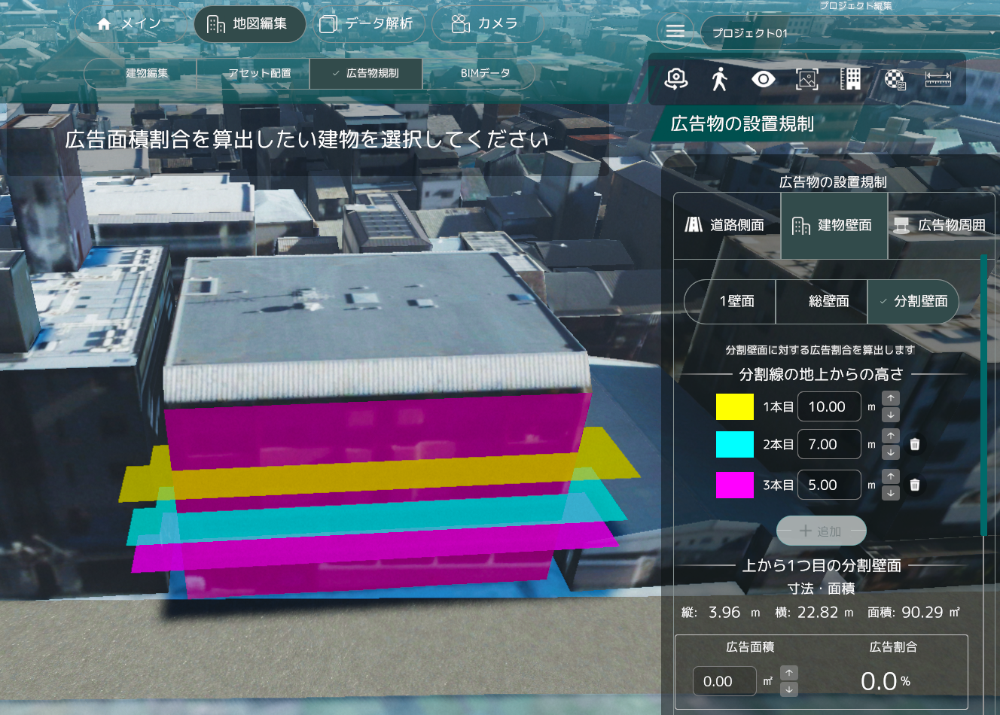

# 景観まちづくり支援ツール

## 概要

本リポジトリでは、Project PLATEAU の令和7年度「まちづくりDXの推進に向けた3D都市モデルの利用環境向上業務」として実施した、UC25-12「景観まちづくりDX v3.0」の成果物である、「景観まちづくり支援ツール」のソースコードを公開しています。

「景観まちづくり支援ツール」は、PLATEAUの3D都市モデルを活用し、都市計画・景観計画の検討や屋外広告物の申請・審査業務を支援する景観シミュレーションツールです。
