# 広告物規制
## 広告物規制画⾯の操作⽅法
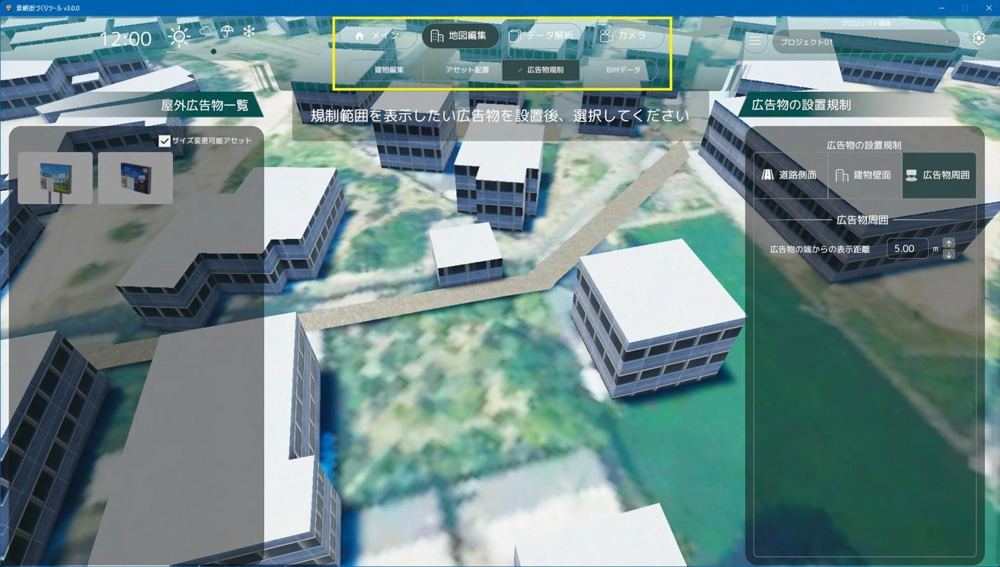
- 広告物規制機能は、屋外広告物の設置に関する各種規制を可視化し、  事業者からの新規申請や変更申請に対する適合評価を支援するための機能です。
- 任意の2点間の距離の確認を行う場合は、[2点間距離計測機能](https://project-plateau.github.io/landscape-design-tool/manual/navigation.html#%E3%82%B5%E3%83%96%E3%83%A1%E3%83%8B%E3%83%A5%E3%83%BC2%E7%82%B9%E9%96%93%E8%B7%9D%E9%9B%A2%E8%A8%88%E6%B8%AC%E6%A9%9F%E8%83%BD)を使用できます。

## 道路側⾯の設置規制範囲表⽰機能
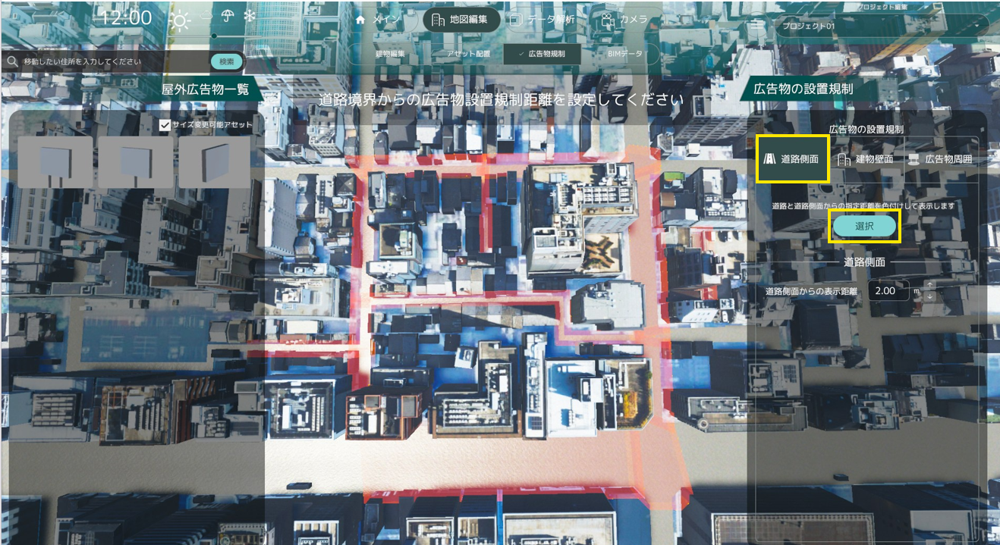
- 道路境界から一定距離の屋外広告物の設置規制範囲を表示する機能です。
- 「道路側面」を選択し、3Dビュー上で対象の道路を囲うように広めにドラッグします。
- 選択を押すと道路を選択でき、キャンセルを押すと視点を移動できます。

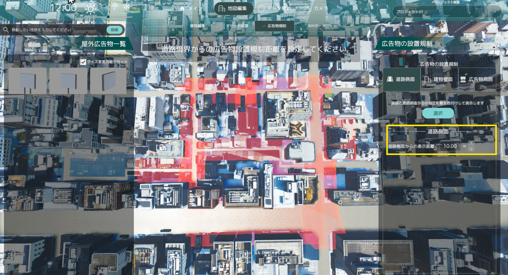
- 道路を選択すると、道路および側面の設置規制範囲が色付きで表示されます。  
- 道路側面からの表示距離を入力すると、規制範囲が変更されます。  
- 表示距離は20.00m以内の数値を指定できます。

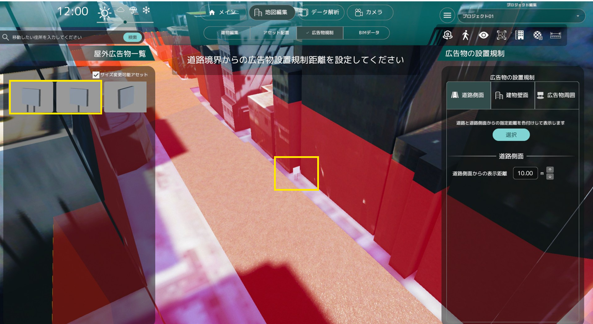
- アセットの写真をクリックすることで配置するアセットを選択します。
- アセット選択後に3D空間上で再度クリックすることでアセットを配置します。
- アセット配置をやめたい場合は、アセット選択後かつ配置前に右クリックしてください。
- 右上のプロジェクト一覧から、統合して保存ボタンを選択することで、  設置規制範囲を含めてエクスポートできます。

## 1壁⾯の広告割合算出機能
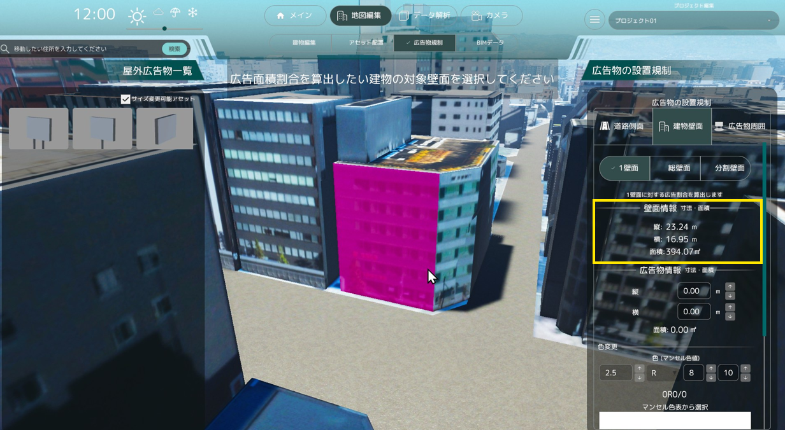
- 建物の1つの壁面に対する広告面積の割合を算出する機能です。
- 壁面情報欄には、選択した壁面の縦・横の長さおよび面積が表示されます。  
- Ctrl キーを押しながら選択すると、複数の壁面を同時に選択できます。  
- 複数壁面を選択した場合、縦の長さは選択した壁面の最大値、  横の長さおよび面積は合計値が表示されます。

> [!NOTE]  
> 表示される 縦・横の長さの値は、1壁面を選択し、かつその壁面形状が矩形の場合を想定した目安です。 
> 複数壁面選択時や非矩形の壁面では、縦・横の長さは参考情報としてご利用ください。

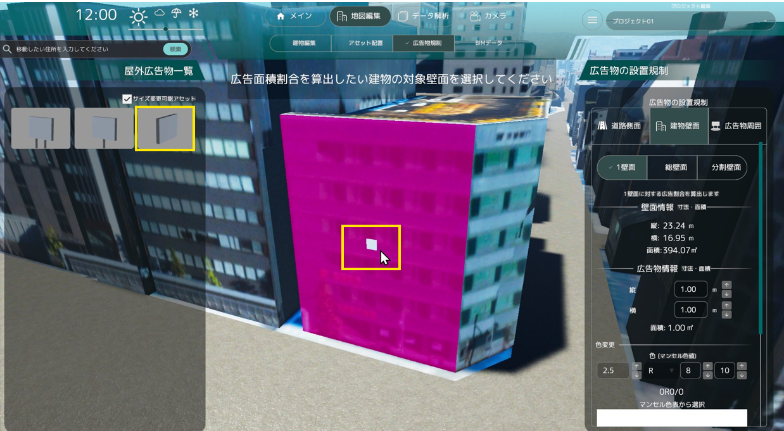
- 屋外広告物⼀覧から壁面広告物アセットを選択します。
- アセット選択後に壁⾯上で再度クリックすることでアセットを配置します。
- アセット配置をやめたい場合は右クリックしてください。

> [!NOTE]  
> 設置やサイズ変更ができる本機能に対応するアセットは、現状1種類(壁⾯広告物)のみです。 
> 1つの壁面に複数の壁面広告物を設置することは可能ですが、  広告面積の算出は1つの広告物のみを対象としています。 
> 同一壁面に複数の広告物を設置しても、2つ目以降の広告物の面積は算出結果に反映されません。

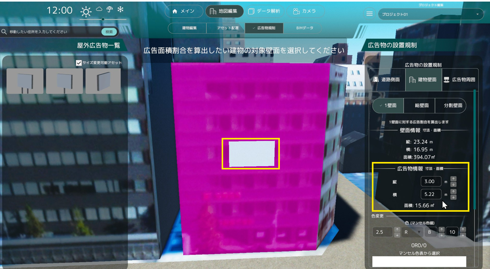
- 広告物情報欄で縦・横の長さを入力すると、面積が算出され、配置した広告物の表示サイズも連動して変更されます。
- 広告物の横移動や削除、画像・動画の読み込みをする場合は、「アセット配置機能」をご利用ください。

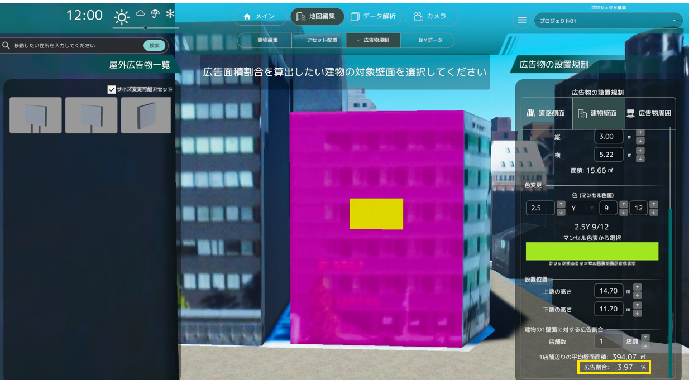
- 画面を下にスクロールすると、広告割合が確認できます。

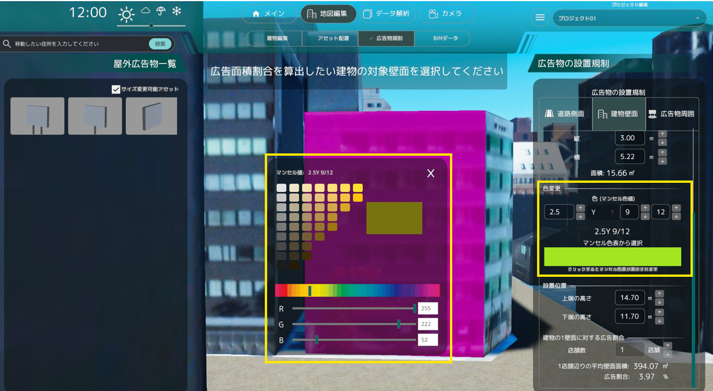
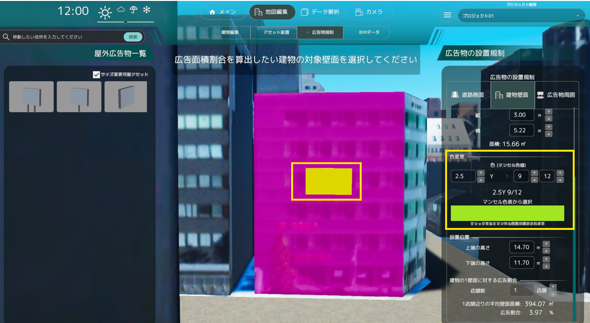
- 色変更欄でマンセル値を入力、またはマンセル色票から選択すると、  広告物の色が変更されます。  
- 色が変更されない場合は、広告物アセットをクリックして再選択してください。	
- 色彩編集時に表示されるプレビューの色は、操作確認用の表示です。  
- 実際にアセットに設定される色は、3Dビュー上に表示されているアセットの色をご確認ください。

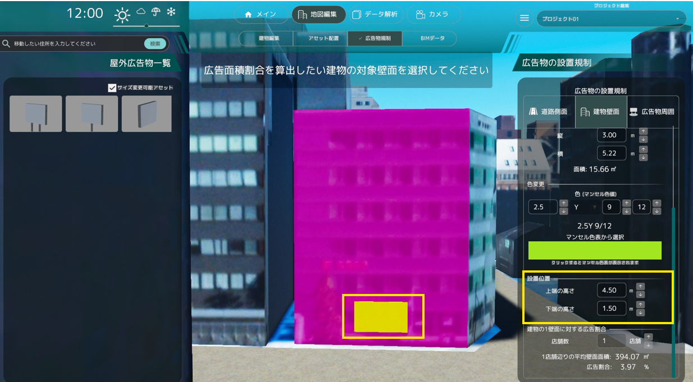
- 設置位置欄で、地面から広告物の上端または下端までの高さを入力すると、  広告物の壁面上の位置が変更されます。

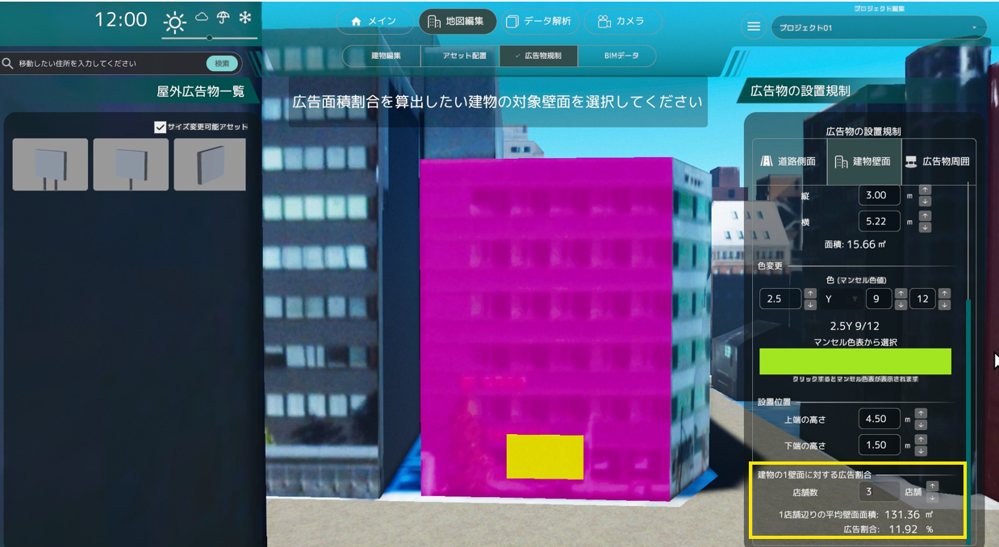
- 対象壁面に複数の店舗がある場合、店舗数を入力すると、対象壁面の面積を店舗数で均等に分けた場合の、1店舗当たりの平均壁面面積および広告割合が算出されます。

## 総壁⾯の広告割合算出機能
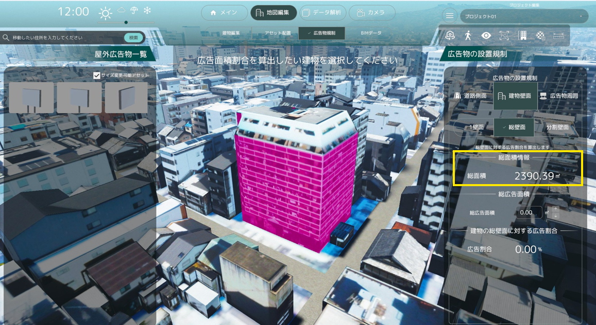
- 建物の総壁面面積に対する広告面積の割合を算出する機能です。
- 総壁面を確認したい建物を選択します。
- 総壁面情報欄に、選択した建物のすべての壁面の総面積が表示されます。

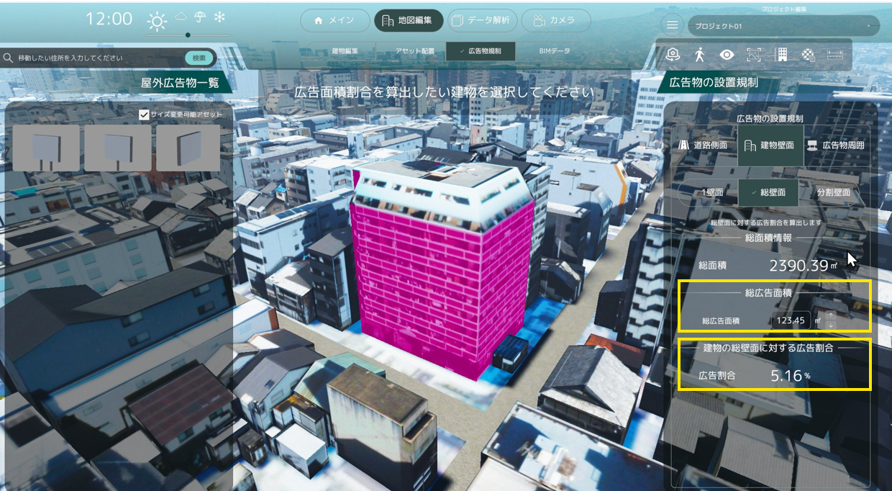
- 総広告面積欄に、すべての広告の総面積を入力すると、  建物の総壁面に対する広告割合が算出されます。
- なお、本機能では広告物アセットの設置機能はありません。

## 分割壁面の広告割合算出機能
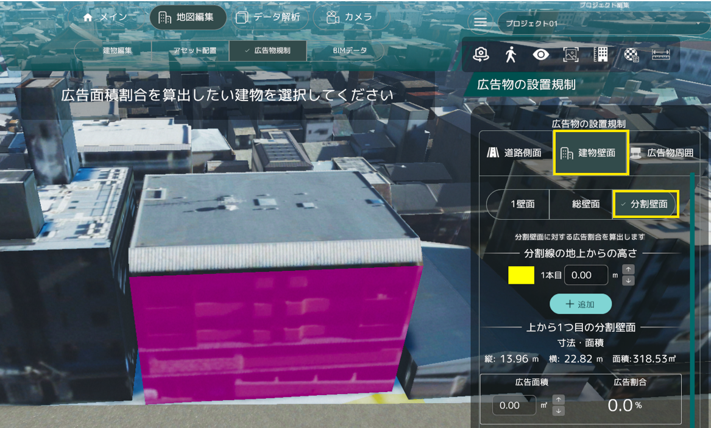
- 建物の壁面を分割し、分割された壁面ごとの広告割合を算出する機能です。
- 対象の建物の壁面を選択します。

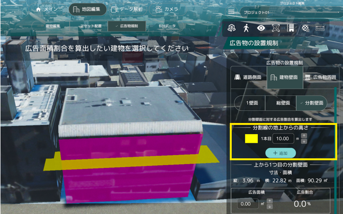

- 分割線の地上からの高さを入力すると、入力した高さに分割線が表示されます。  

- 分割線は最大3本まで設定できます。

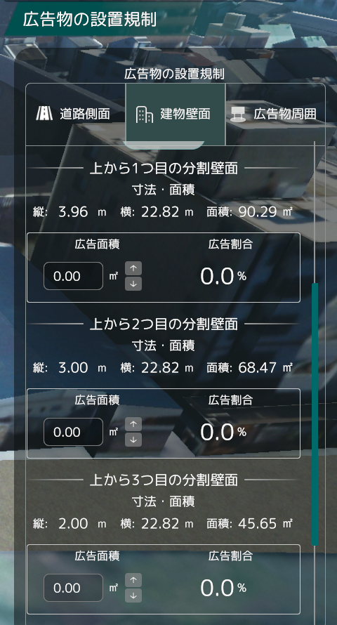

- 分割線により分割された各壁面の寸法および面積が表示されます。

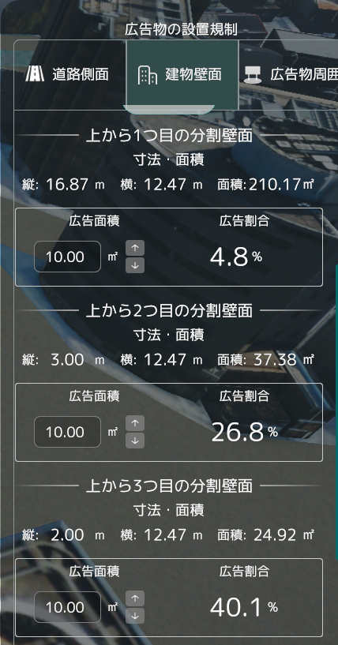

- 該当する分割壁面の入力欄に広告面積を入力すると、  分割壁面ごとの広告割合が算出されます。
- なお、本機能では、広告物アセットの設置機能はありません。

## 広告物周囲の設置規制範囲表⽰機能
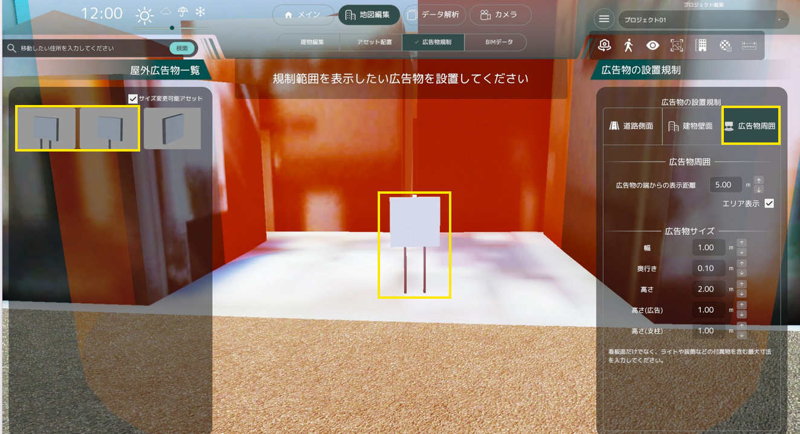
- 設置した屋外広告物の周囲に適用される規制範囲を表示する機能です。
- 屋外広告物⼀覧からアセットの写真をクリックすることで配置するアセットを選択します。
- アセット選択後に3D空間上で再度クリックすることでアセットを配置します。
- アセット配置をやめたい場合は右クリックしてください。
- 広告物を配置すると、広告物の各端から一定距離の  設置規制範囲が色付きで表示されます。

- 広告物は複数連続して設置できます。  
- アセット配置をやめたい場合は右クリックしてください。
- 広告物の移動や削除、画像・動画の読み込みをする場合は、「アセット配置機能」をご利用ください。

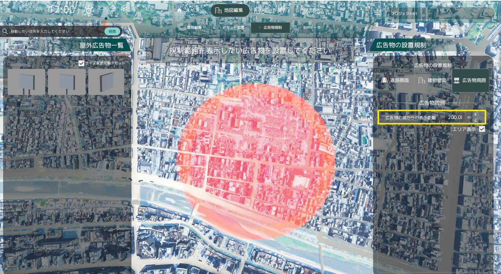
- 広告物の端からの表示距離を入力することで、規制範囲の表示も変更できます。

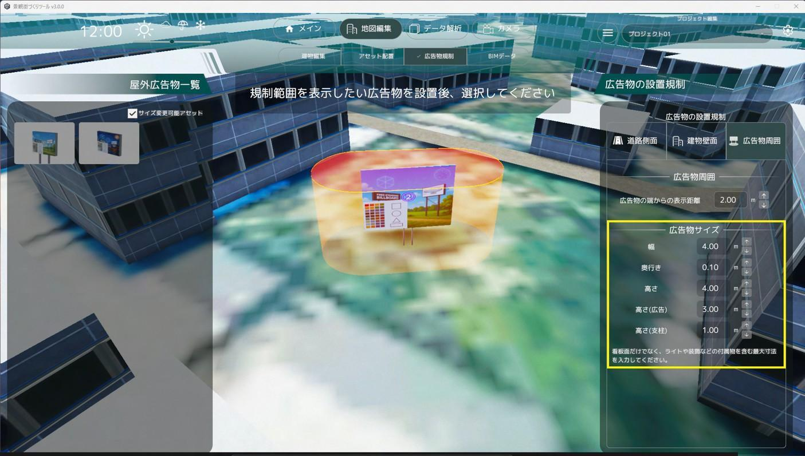
- 広告物の⼨法を⼊⼒すると、サイズが変更され、設置規制範囲も変更されます。

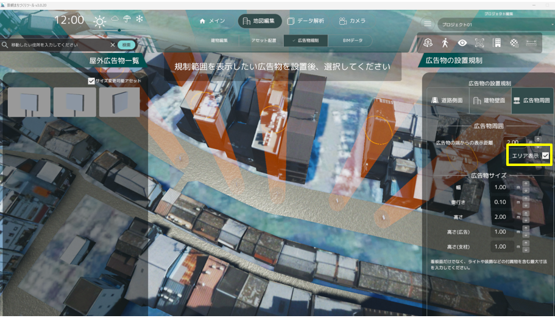
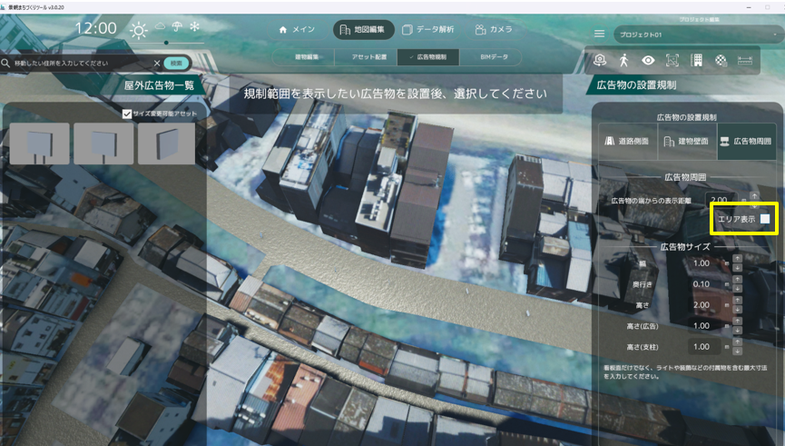

- 「エリア表示」のチェックを外すと規制エリアの表示が非表示になります。
- 右上のプロジェクト一覧からプロジェクトを保存することで、エクスポートが可能です。
