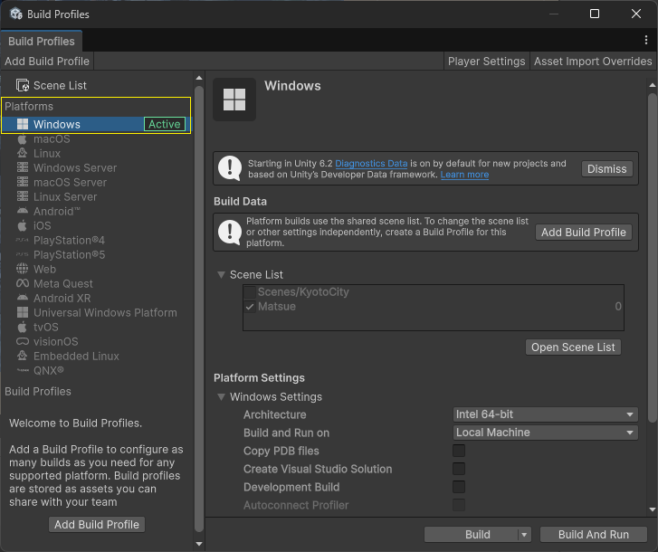
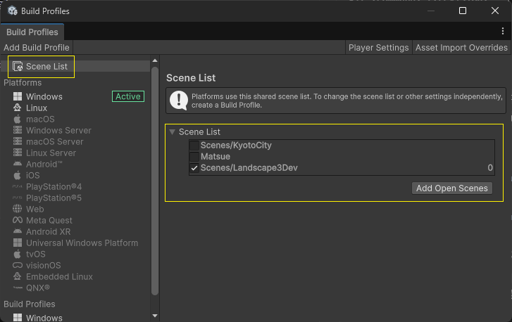
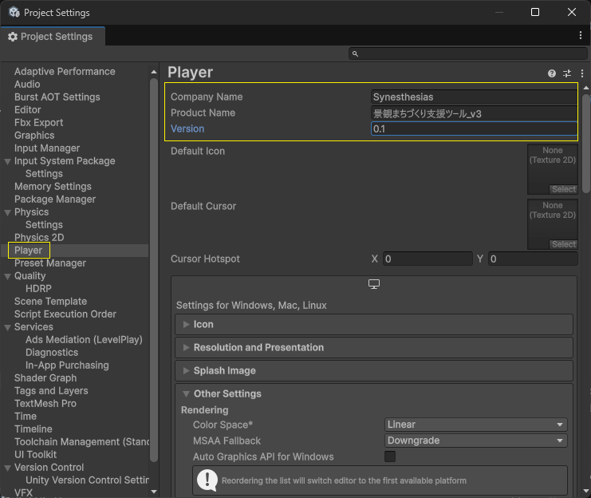
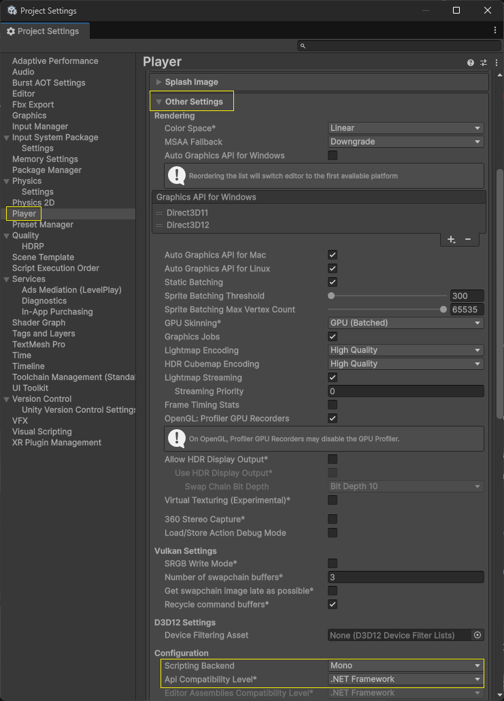
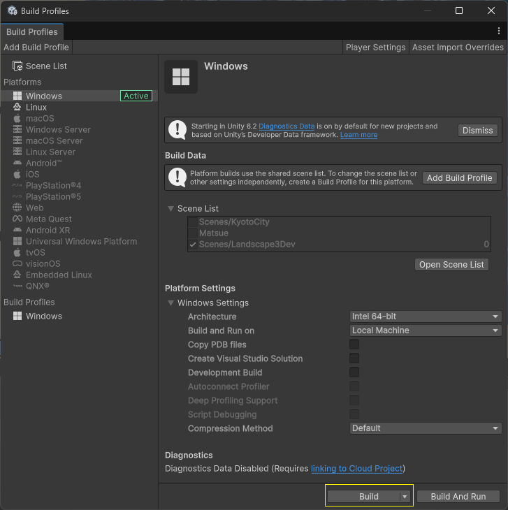
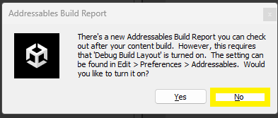

# ビルド

本ツールを使用するため Windows 向けにアプリケーションをビルドする手順を解説します。

なお、[基本操作](./BasicOperation.md)以降の手順はランタイム（実行時）の解説になります。

## 1. 準備

`File` → `Build Profiles` を開き、Platformsで`Windows`がActiveに設定されていることを確認します。

設定されていない場合は、以下の手順を実行してください。

- Platformsを`Windows`に設定
- Architectureを`Intel 64bit`に設定（推奨）
- `Switch Platform`ボタンをクリック

## 2. ビルド設定

`Scene List`で作成したシーン（[セットアップ](./Setup.md)を行ったもの）を選択します。まだ`Scene List`に対象シーンがない場合は、`Add Open Scenes`から対象シーンを追加してください。

`Player Settings` をクリックし、以下の設定を確認します。

- `Company Name`、`Product Name`、`Version`を適切に設定
- `Other Settings` → `Configuration` → `Scripting Backend` を `Mono` に設定
- `Other Settings` → `Configuration` → `API Compatibility Level` を `.NET Framework` に設定

    

## 3. ビルド

`Build` ボタンをクリックし、出力フォルダを指定します。

もし次のようなウィンドウが表示されたら`No`を選択してください。

ビルドが完了すると、指定フォルダ内に`.exe`ファイルが生成され、エクスプローラーで出力フォルダが開きます。

## 4. 実行

出力フォルダの`.exe`ファイルをダブルクリックして実行します。