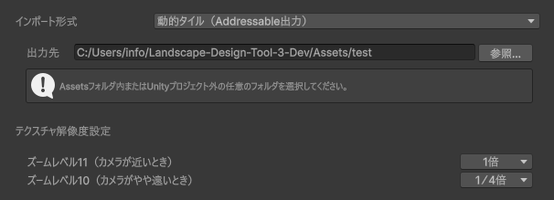
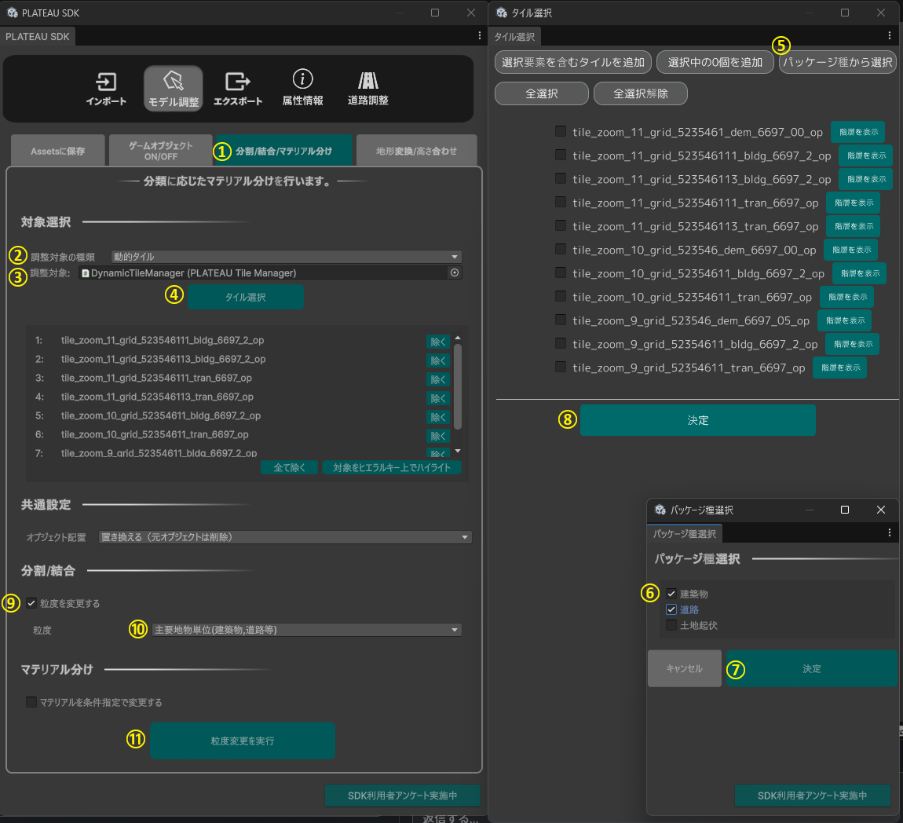
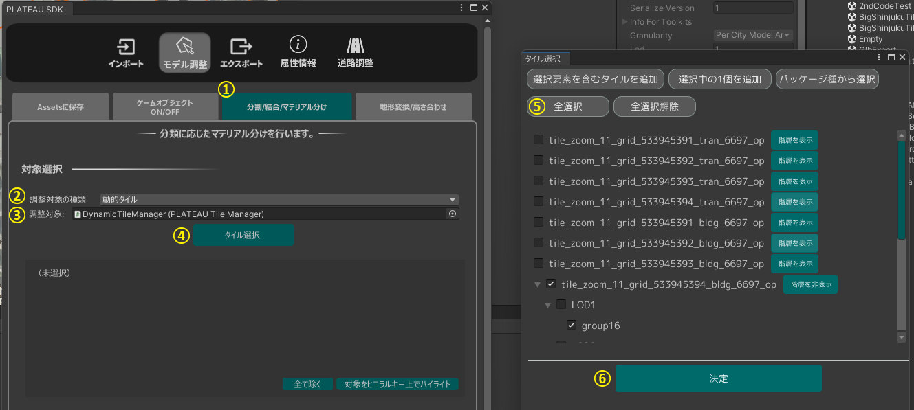
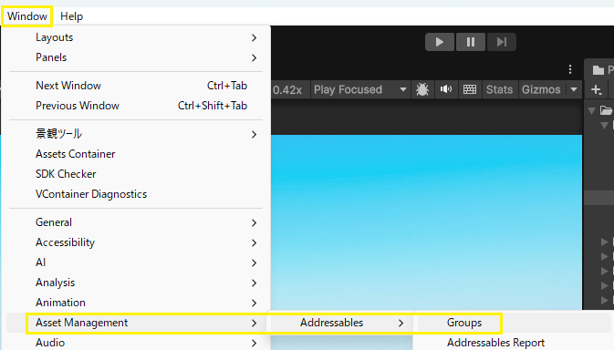
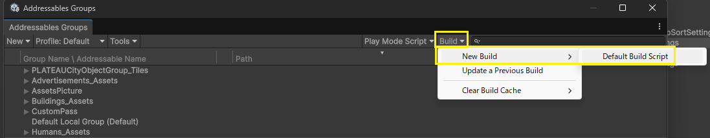
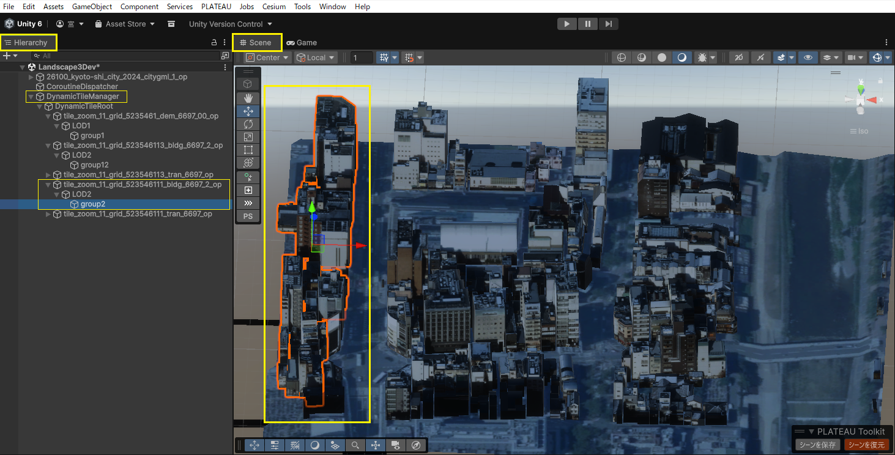
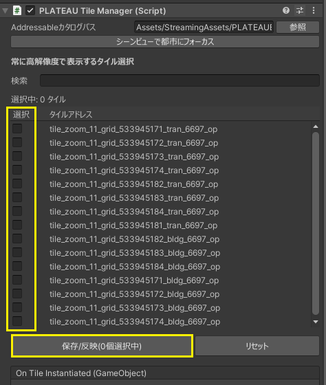
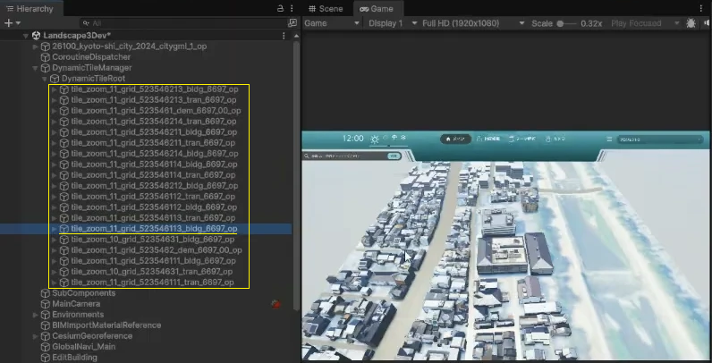
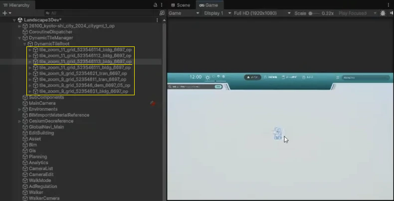

# 広域表示機能
広域表示機能は、PLATEAU SDK for Unity の動的タイルを利用し、広い範囲の都市モデルを表示する際の描画処理を最適化する機能です。動的タイルの詳細については、[PLATEAU SDK for Unity マニュアル](https://project-plateau.github.io/PLATEAU-SDK-for-Unity/manual/dynamicTile.html)を参照ください。

## 1. 都市モデルのインポート
[都市モデルのインポート](../manual/Setup.md#7-都市モデルのインポート)時に、インポート形式で`動的タイル（Addressable出力）`を選択し、動的タイルの出力先及びテクスチャ解像度を設定してください。テクスチャ解像度の倍率は、ズームレベルごとにテクスチャ解像度の1辺の大きさを何倍にするかを表しています。倍率を下げることで描画負荷を下げ、軽量化できます。

## 2. ゲームオブジェクトの分割
動的タイル形式でインポートされたゲームオブジェクトは地域単位となります。景観まちづくりツールの機能を使用するために、モデル調整から主要地物単位に分割する必要があります。

PLATEAUウィンドウの`モデル調整` → `分割/結合/マテリアル分け`を開きます。調整対象の種類を動的タイルに設定し、`タイル選択`ボタンを押すとタイル選択画面が表示されます。`パッケージ種から選択`ボタンを押し、`建築物`と`道路`を選択後、`決定`ボタンを押すと、タイルが選択されているため、問題がなければ`決定`ボタンを押してください。分割/結合欄で`粒度を変更する`にチェックを入れ、粒度を`主要地物単位（建築物,道路等）`に設定し、`粒度変更を実行`ボタンを押すと、処理が始まります。

詳細は[PLATEAU SDKの分割・結合・マテリアル分け機能マニュアル](https://project-plateau.github.io/PLATEAU-SDK-for-Unity/manual/ModelAdjust.html#%E5%88%86%E5%89%B2%E7%B5%90%E5%90%88%E3%83%9E%E3%83%86%E3%83%AA%E3%82%A2%E3%83%AB%E5%88%86%E3%81%91%E6%A9%9F%E8%83%BD)を参照ください。

## 3. 地形変換/高さ合わせ
以下の2種類の調整を行います。こちらの手順は土地起伏タイルがシーンに含まれていることが前提です。
- 地形の平滑化
  - 地形モデル（インポート時の表記は"土地起伏"）の平滑化・テレインへの変換を行います。
- 高さ合わせ
  - LOD1道路等、高さが付与されていない地物の地形への高さ合わせや、LOD3道路のように高さは付与されているが地形モデルにめり込んでしまっている場合の地形モデルの形状修正を行います。

PLATEAUウィンドウの`モデル調整` → `地形変換/高さ合わせ`を開きます。調整対象の種類を`動的タイル`に設定し、調整対象に`PLATEAUTileManager`を選択してください。`タイル選択`ボタンを押すと、タイル選択画面が開くので、`全選択`ボタンを押して、決定ボタンを押します。オブジェクト配置が`置き換える`となっていることを確認してから、`実行`ボタンを押してください。

詳細は[PLATEAU SDKの地形変換/高さ合わせ機能マニュアル](https://project-plateau.github.io/PLATEAU-SDK-for-Unity/manual/ModelAdjust.html#%E5%9C%B0%E5%BD%A2%E5%A4%89%E6%8F%9B%E9%AB%98%E3%81%95%E5%90%88%E3%82%8F%E3%81%9B%E6%A9%9F%E8%83%BD)を参照ください。

> [!NOTE]  
> 動的タイルやアセットがビルドデータで表示されない場合は、以下の手順をお試しください。
> 1. メニューから`Window` → `Asset Management` → `Addressables` → `Groups` を選択し、`Addressables Groups`ウィンドウを開きます。
> 2. タブから`Build` → `New Build` → `Default Build Script`を実行してください。

## 4. 常に高解像度で表示するタイルの選択
通常、動的タイルはカメラの距離に応じて解像度が切り替わりますが、本機能で選択したタイルは、カメラが離れた場合でも高解像度のまま表示されます。これにより、重要な建物やエリアについて、広域表示時でも描画クオリティを維持した表示が可能です。

動的タイル形式での都市モデルのインポート後、Hierarchyから`DynamicTileManager`のオブジェクトを選択し、`PLATEAU Tile Manager`のインスペクタから、常に高解像度で表示するタイルを選択してください。
選択可能なタイルは、最も高解像度であるズームレベル11のタイルのみです。名前が`tile_zoom_11`から始まるオブジェクトが、ズームレベル11のタイルに該当します。検索欄を使用すると、オブジェクト名で絞り込んで検索できるため、Scene画面でランドマーク等をクリックし、Hierarchyでランドマーク等が含まれるオブジェクトを特定すると、スムーズに選択できます。タイルを選択後、`保存/反映`ボタンを押すと、設定が反映されます。

出典：PLATEAU SDK for Unity マニュアル（https://project-plateau.github.io/PLATEAU-SDK-for-Unity/manual/dynamicTile.html）

### カメラがタイルから近い状態
タイルは高解像度で表示されます。下図はUnity Editorでタイルを表示した例です。図の右側にあるGame画面で、カメラを3D都市モデル（タイル）に近づけると、Hierarchyには、名前が`tile_zoom_11`から始まるズームレベル11のタイルオブジェクトが、動的に配置されます。

### カメラがタイルから離れている状態
常に高解像度で表示する設定をしたタイルとその周辺のタイルのみ高解像度で表示されます。下図の例では、`tile_zoom_11_grid_523546113_bldg_6697_op`というタイルを、常に高解像度で表示するタイルとして設定しました。Game画面でカメラを3D都市モデル（タイル）から離すと、Hierarchyには名前が`tile_zoom_11`から始まるズームレベル11のタイルオブジェクトと、名前が`tile_zoom_9`から始まるズームレベル9のタイルオブジェクトが、動的に配置されます。ズームレベル11のタイルオブジェクトは、常に高解像度で表示する設定をしたタイルとその周辺のタイルです。

