# 1. 本書について

本書では、ツールの動作環境やセットアップについて記載しています。

# 2. 動作環境

### 検証済環境

| 項目              | 最小動作環境                | 推奨動作環境              | 
|------------------|--------------------------|--------------------------| 
| CPU             | Intel クロック周波数 2GHz 以上 | Core i7（8コア）以上                     | 
| GPU             | NVIDIA® GeForce RTX™  3060以上| NVIDIA® GeForce RTX™ 4060 Laptop GPU                      | 
| メモリ          | 16GB 以上                 |  32GB 以上                         | 
| ストレージ      | 200GB 以上の空き容量       | 同左                      | 
| OS             | Windows 11 Home 64 ビット | 同左                      |

# 3. セットアップの手順

## 1. Unityのダウンロードとインストール
- Unity Hub を[こちら](https://unity3d.com/jp/get-unity/download)からインストールします。
- Unity Hub とは、Unityのお好きなバージョンをインストールして起動することのできるソフトウェアです。
- Unity Hubを起動し、左のサイドバーから`インストール`を選択し、右上の`エディターをインストール`ボタンを押します。

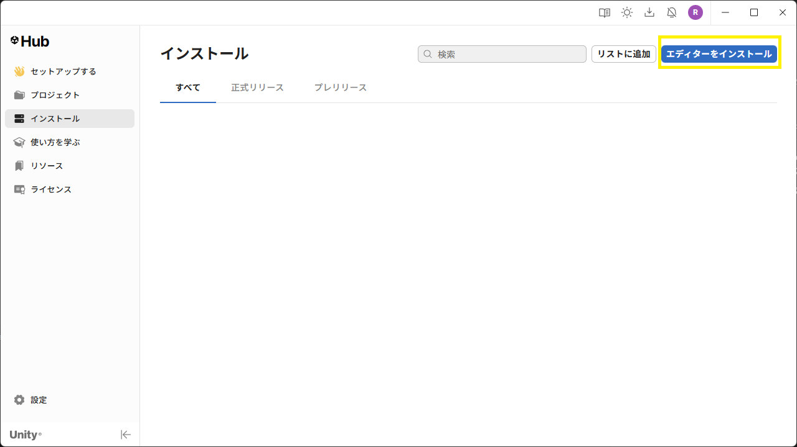

アーカイブタブの[ダウンロードアーカイブ](https://unity.com/releases/editor/archive)から、Unityダウンロードアーカイブを開き、`Unity 6000.3.10f1`をインストールします。

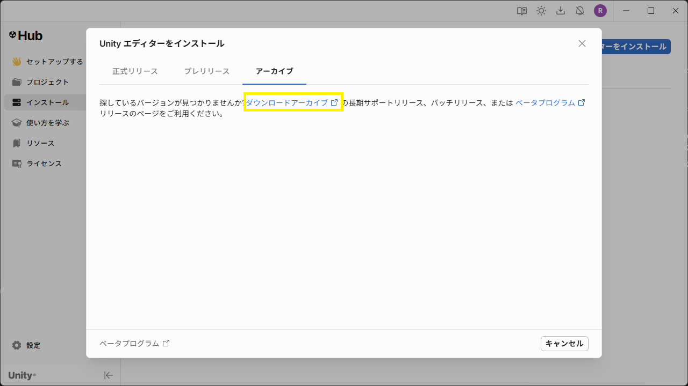

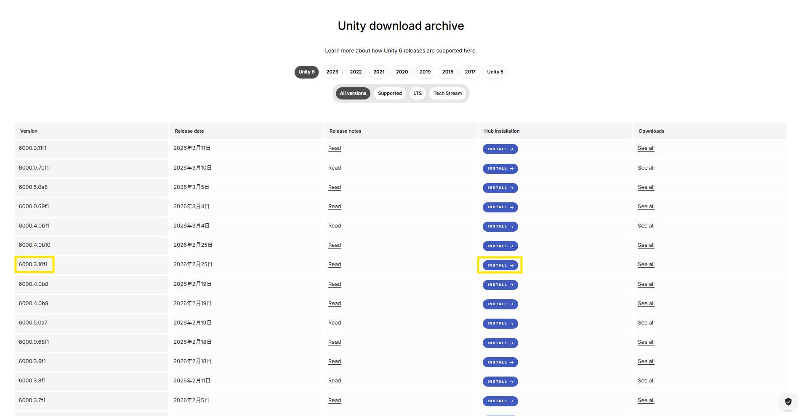

## 2. Unityプロジェクトを作成
Unity Hub を起動します。

左サイドバーの `プロジェクト` を押し、右上の `新しいプロジェクト` ボタンを押します。

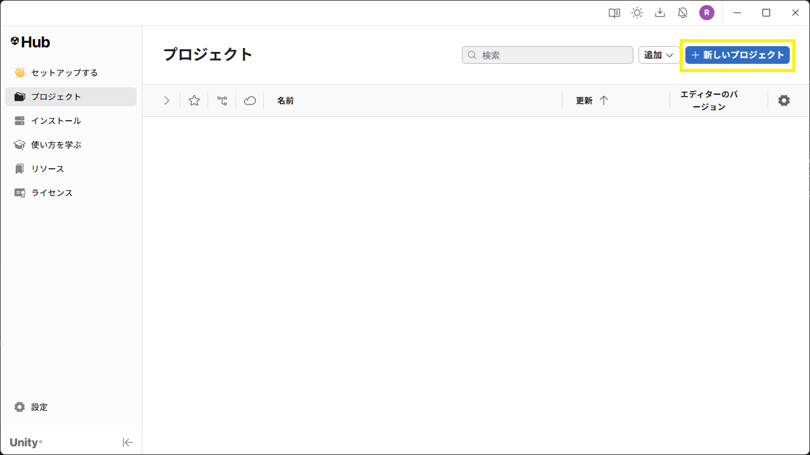

新しいプロジェクトの設定画面で、次のように設定します。
- 画面上部の `エディターバージョン` を `6000.3.10f1` にします。
- 画面中部の `テンプレート` は `High Definition 3D` を選択します。
- 画面右下のプロジェクト名をお好みのものに設定します。
- `プロジェクトを作成`ボタンを押します。

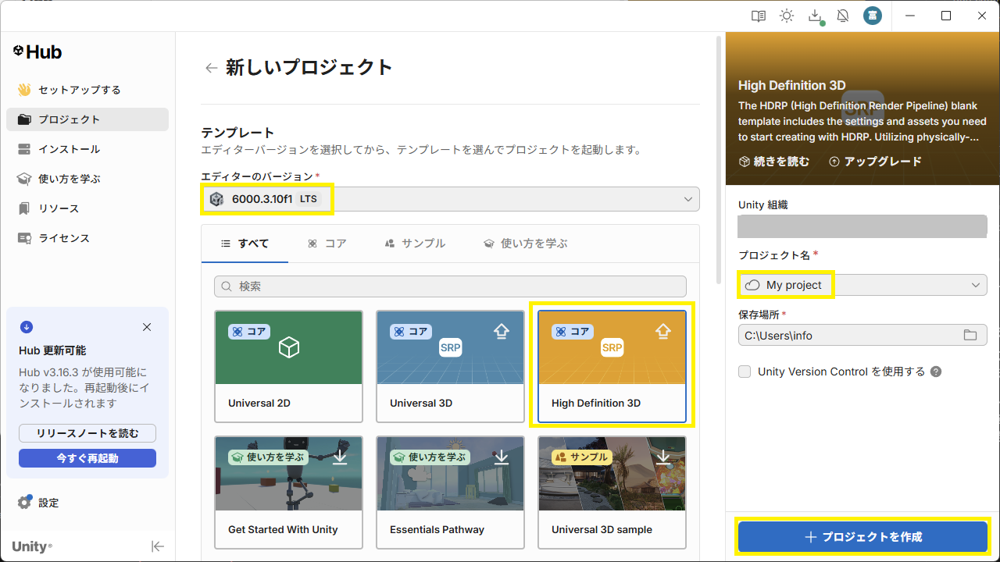

## 3. ツールをUnityにインポート

- 作成したプロジェクトをクリックすると、Unityが起動します。
- Unityが起動したら、以下の各ツールのリリースページからtgzファイルをダウンロードします。
  - [PLATEAU SDK for Unityのリリースページ](https://github.com/Project-PLATEAU/PLATEAU-SDK-for-Unity/releases)
  - [cesium-unityのリリースページ(v1.16.0)](https://github.com/CesiumGS/cesium-unity/releases/tag/v1.16.0)
  - [LandscapeDesignToolのリリースページ](https://github.com/Project-PLATEAU/landscape-design-tool/releases)
- また、上記の `LandscapeDesignToolのリリースページ` にて配布している以下のパッケージをダウンロードしてください。
  - PLATEAU-SDK-Toolkits-for-Unity（com.synesthesias.plateau-unity-toolkit-2.2.1.tgz）
  - PLATEAU-SDK-Maps-Toolkits-for-Unity（com.unity.plateautoolkit.maps-1.0.21.tgz）

> [!NOTE]  
> git指定で導入する方法は以下を参考にしてください。 
> [SDKの使い方:GitのURL指定で導入する方法](https://project-plateau.github.io/PLATEAU-SDK-for-Unity/manual/Installation.html#git%E3%81%AEurl%E6%8C%87%E5%AE%9A%E3%81%A7%E5%B0%8E%E5%85%A5%E3%81%99%E3%82%8B%E6%96%B9%E6%B3%95)

- ダウンロードできたら、Unityのメニューバーから `Window` → `Package Manager` を選択します。
- Package Manager ウィンドウの左上の `＋` ボタンから `Add pacakge from tarball...` を選択します。

- 先ほどダウンロードした 各ツールの tgz ファイルを指定します。するとウィンドウのパッケージ一覧に各ツール名が表示されます。

> [!NOTE]  
> tgz ファイルは 必ず以下の順番で1つずつインポートしてください。順番が異なる場合、依存関係の影響により正常に動作しないことがあります。 
> 指定順：
> 1. PLATEAU SDK for Unity  
> 2. PLATEAU-SDK-Toolkits-for-Unity  
> 3. Cesium for Unity  
> 4. LandscapeDesignTool  
> 5. PLATEAU-SDK-Maps-Toolkits-for-Unity

- 続けて、`Unity gltfast` のバージョンを更新します。Package Managerウィンドウの左上の `＋` ボタンから `Add package by name...` を選択します。

- `name` に `com.unity.cloud.gltfast` を指定し、`version` に `6.9.0` を指定します。指定ができたら `Add` を押して下さい。

- packageの検索で `gltFast` を検索して、`Unity gltFast` のバージョンが `6.9.0` に更新されていることを確認できたら完了です。

- 全てのツールを導入したら、Package Manager ウィンドウを閉じます。

## 4. Unityプロジェクトの設定

- Unityのプロジェクト設定をします。メニューバーから Edit → Project Settings… を選びます。

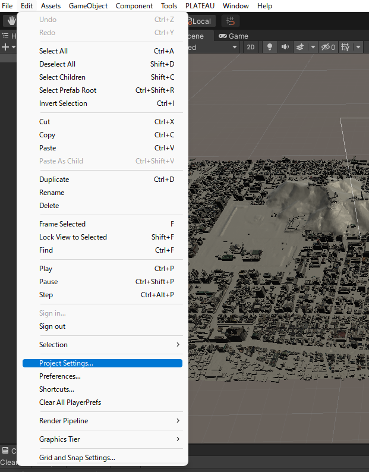

- Project Settings ウィンドウの左側のパネルから`Player`を選択し、`Other Settings`タブを開きます。`Api Compatibility Level`が`.NET Framework`ではない場合、`.NET Framework`に変更してください。
- `Active Input Handling` を `Both` に変更して、Project Settings ウィンドウを閉じます。

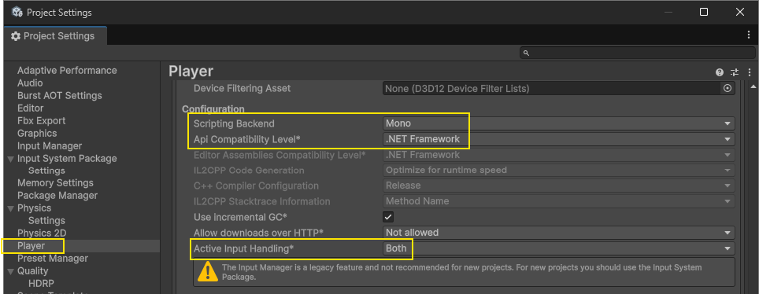

## 5. 事前準備

### 新しいシーンの作成

- メニューバーから `File` → `New Scene` を選択します。
- `Empty` を選択して新しいシーンを作成します。

### PLATEAUの都市モデル(CityGML)データの用意
事前にG空間情報センターの[3D都市モデル（Project PLATEAU）ポータルサイト](https://front.geospatial.jp/plateau_portal_site/)から景観計画・協議を行いたいエリアの都市モデルデータ(CityGMLファイル一式)をダウンロード、解凍してください。

> [!NOTE]  
> 都市モデルデータには地形(demフォルダ), 建築物(bldgフォルダ)が含まれている必要があります。

## 6. 事前設定の実行

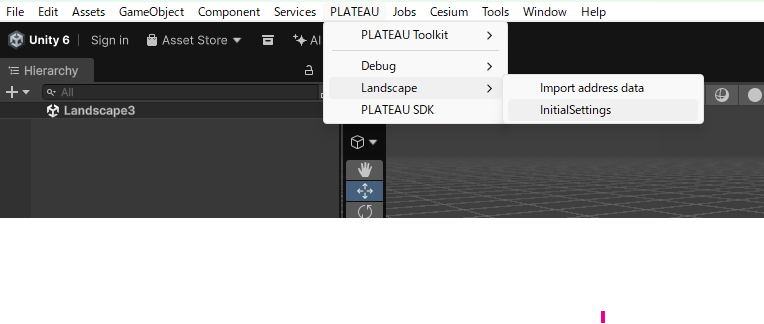

- メニューから `PLATEAU` → `Landscape` → `InitialSettings` の順に選択し、初期設定画面を開きます。

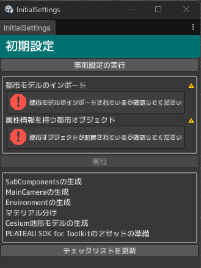

- 初期設定画面の`事前設定の実行`ボタンを押して、事前設定の処理を開始します。

## 7. 都市モデルのインポート
### 都市モデルインポート画面を開く
メニューから `PLATEAU` → `PLATEAU SDK`を選択します。

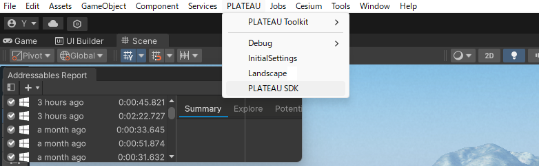

表示されるウィンドウで都市インポートの設定を行います。インポート元を選択し、基準座標系を選んで`範囲選択`ボタンを押してください。インポート元は、ローカルの場合は `udx`という名前のフォルダの1つ上のフォルダになります。また、インポート形式を動的タイルに設定する場合は[こちら](DynamicTiles.md#広域表示機能)を参照ください。

詳しくは [PLATEAUマニュアル: インポート](https://project-plateau.github.io/PLATEAU-SDK-for-Unity/manual/ImportCityModels.html) をご覧ください。

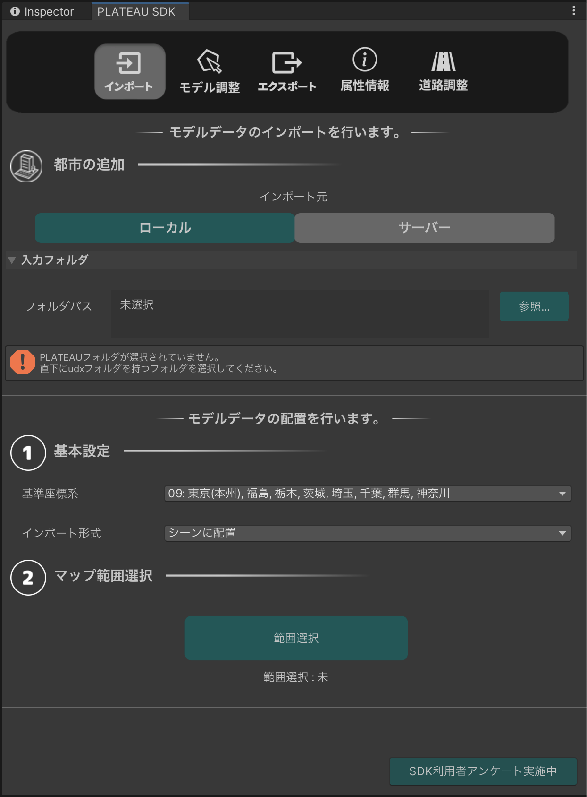

### 範囲選択
範囲選択画面では、マウスホイールの上下でズームイン・ズームアウト、右クリックのドラッグで視点移動します。オレンジ色の球体をドラッグして範囲を選択し、シーンビュー左上の`決定`ボタンを押します。

インポートに含める地物の種類を選択します。
景観まちづくり機能を利用するには、次をすべて満たす設定にしておく必要があります。

- `建築物`、`道路`、`土地起伏`で、`インポートする`にチェックが入っていること
- `建築物`、`道路`、`土地起伏`で、`MeshColliderをセットする`にチェックが入っていること
- `建築物`、`道路`で、`モデル結合`は`主要地物単位`にしておくこと
  - 動的タイルの場合は地域単位となるため、インポート後にモデル調整から主要地物単位に分割すること

設定したら`モデルをインポート`ボタンを押します。そのままウィンドウを下にスクロールすると処理の進行状況が表示されるので、すべて`完了`になったらインポートは完了です。

## 8. 初期設定機能の実行

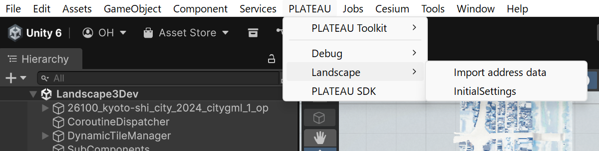

- メニューから `PLATEAU` → `Landscape` → `InitialSettings` の順に選択し、初期設定画面を開きます。

- 実行に必要なコンポーネントがシーン上に全て揃っている場合、`実行`ボタンが押せる状態になります。

- 初期設定画面の`実行`ボタンを押して、初期設定の処理を開始します。

- 実行に必要なコンポーネントがシーン上に全て揃っていない場合、実行可能な状態にした後、`チェックリストを更新`ボタンを押すことで、`実行`ボタンが押せる状態になります。

- `チェックリストを更新`ボタンの下に`初期設定が完了しています`と表示されたら、初期設定完了です。

## 9. 街区レベル位置参照情報のインポート
- 住所へ移動機能で使用するデータをインポートします。

- メニューから`PLATEAU` → `Landscape` → `Import address data`の順に選択し、街区レベル位置参照情報インポート画面を開きます。

- [国土数値情報ダウンロードサイト](https://nlftp.mlit.go.jp/isj/)から、3D都市モデルの範囲に該当する街区レベル位置参照情報をダウンロードし、街区レベル位置参照情報インポート画面にドラッグアンドドロップしてください。

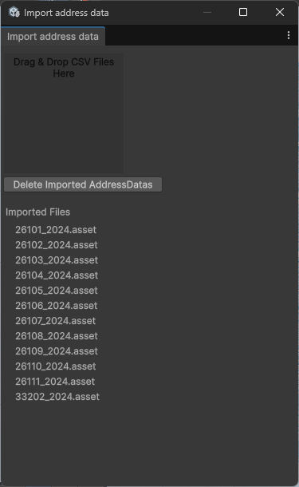
