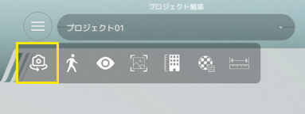
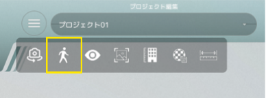
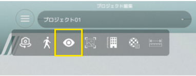
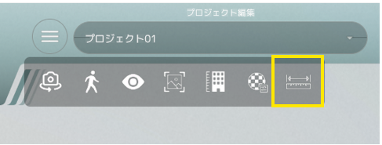
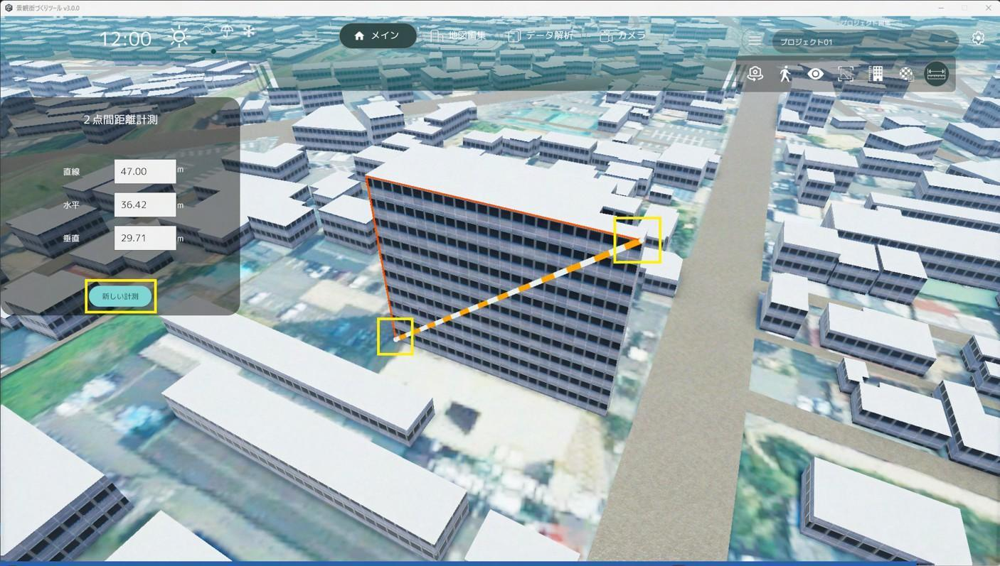
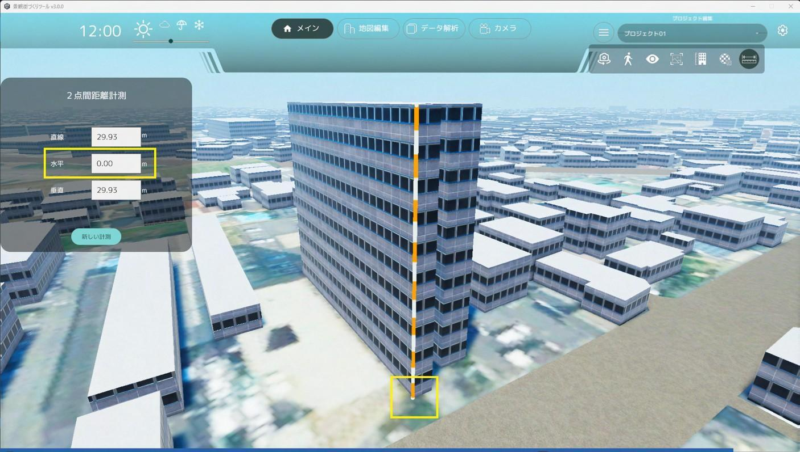
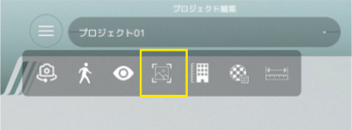
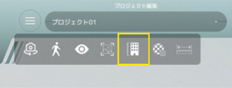
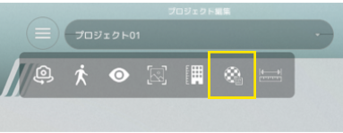

# グローバルナビ各種機能

画面上部グローバルナビゲーションの各種機能を記載しています。

## 気象変更機能

- 3D ビューの気象変更が可能です（晴れ・曇り・雨・雪）

## 時間帯変更機能

- スライダーで変更すると時間帯の変更を行うことが出来ます。

## サブメニュー表示ボタン

- 上の画像にある（≡）ボタンをクリックするとサブメニューが表示されます。

#### ＜サブメニュー＞カメラ自動回転機能

- 現在の視点を中心にカメラが自動回転するようになります。

#### ＜サブメニュー＞歩行者視点モード機能

- 歩行者視点ボタン押下し、3D上をクリックすると、カメラが歩行者視点（約 1.7m 標準）に切り替わります。

#### 歩行者視点画面

歩行者視点になると各種視点移動 UI が表示されます。

- 歩行者視点：視点の高さ調整が行えます。
- 移動：キーボード W・A・S・D ボタンで移動がおこなえます。UI ボタン押下でも移動が可能です。
- 速度：移動速度を設定出来ます。
- 視点回転：上下左右の視点回転が行えます。１回押下で 45 度回転します。
- 歩行者視点モード終了ボタン：押下するとモードが終了し、俯瞰視点に戻ります。

#### ＜サブメニュー＞UI表示/非表示機能

- 画面左右にあるユーザーインターフェースの表示/非表示が出来ます。

#### ＜サブメニュー＞2点間距離計測機能

- 2点間の距離を測定出来ます。

- 始点となる場所を選択し、次に終点となる場所を選択すると、選択した2点間の距離を測定できます。
- 距離は絶対値で表示されるため、始点・終点の選択位置に関わらず常に正の値で表示されます。
- 直線距離のほか、垂直⽅向と⽔平⽅向の距離も計測できます。
- 「新しい計測」をクリックすると、再計測できます。

- 始点を選択した後、Ctrl キーを押すと、計測線が垂直または⽔平軸の近い⽅にスナップします。
- 建物の⾼さなど垂直⽅向を計測する場合、終点は地⾯にスナップします。
- 意図しない⽅向に計測線が延びる場合は、視点を変えて始点の場所をご確認ください。

#### ＜サブメニュー＞スクリーンショット機能

- 現在の視点をスクリーンショットすることが出来ます。

#### ＜サブメニュー＞建物高さ表示機能

- 現在の視点から見える建物の高さを表示することが出来ます。

#### ＜サブメニュー＞テクスチャの表示/非表示

- 建物のテクスチャ切り替え表示することが出来ます。
